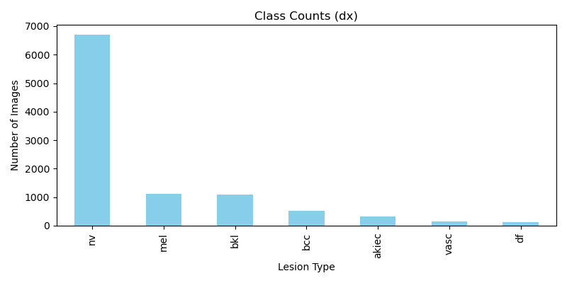
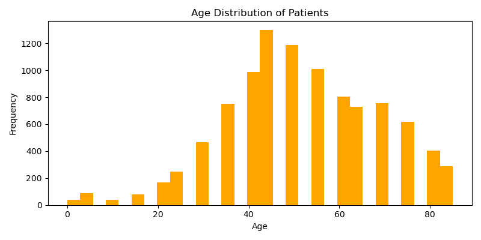
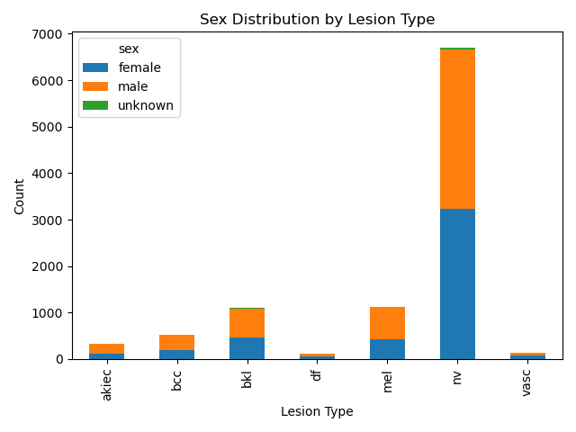

# Skin Cancer Detection Using Multimodal ML Model

This project is focused on detecting skin cancer using images and tabular patient data (age, sex, lesion location) with a multimodal deep learning model (CNN + tabular input).

---

## Dataset Description

The dataset used is **HAM10000** (Human Against Machine with 10000 images), which contains 10,000 dermatoscopic images of common pigmented skin lesions.  
It has **7 classes**:  
- Melanocytic nevi (nv)  
- Melanoma (mel)  
- Benign keratosis-like lesions (bkl)  
- Basal cell carcinoma (bcc)  
- Actinic keratoses (akiec)  
- Vascular lesions (vasc)  
- Dermatofibroma (df)  

The dataset also contains metadata: age, sex, and lesion localization.

---

## Exploratory Data Analysis (EDA)

### 1. Class Distribution
  
*Observation:* Most images are from melanocytic nevi (nv) class, while some classes have fewer samples.

### 2. Age Distribution
  
*Observation:* The majority of patients are in the middle-age range.

### 3. Sex vs Diagnosis
  
*Observation:* Distribution of male and female patients across different skin lesion classes.

---

## Data Preprocessing

- Missing ages were filled with the **median age**.  
- Lesion location was normalized (lowercase, special characters removed).  
- Categorical features (`sex`, `localization`, `dx`) were **label-encoded**.  
- Tabular features (`age`, `sex_enc`, `loc_enc`) were **scaled** using MinMaxScaler.  

---

## Model Architecture

The project uses a **multimodal deep learning model**:  
- **Image branch:** MobileNetV2 or EfficientNetB0 (pretrained, frozen initially) + Dense layers + Dropout + BatchNormalization  
- **Tabular branch:** Dense layers for `age`, `sex`, `localization`  
- **Merged branch:** Concatenate image and tabular features → Dense layers → Softmax output  

---

## Training and Evaluation

- Train/test split: 80/20 stratified by diagnosis.  
- Loss: categorical_crossentropy  
- Optimizer: Adam  
- Metrics: accuracy  

---

## Charts During EDA & Analysis

### Class Distribution by Diagnosis

### Age Distribution

### Sex Distribution by Diagnosis

### Example Predicted vs Actual Grid
  
*Observation:* Shows predicted class, actual class, and confidence for multiple sample images.  

---

## Test Results

- Example test images were fed to the model.  
- Predictions include **predicted class**, **actual class**, and **confidence**.  
- Grid view of predictions provides a **user-friendly overview**.  

> *(Insert your screenshots of single image predictions and grid predictions here.)*

---

## GitHub Repository

All code, model files, metadata, and charts are included in this repository:  
[Skin Cancer Detection Repository](https://github.com/Umar5199/Skin-Cancer-Detection)

---

## Conclusion

- Successfully built a **multimodal model** for skin lesion classification.  
- Demonstrated EDA, preprocessing, and model evaluation.  
- Project is reproducible; charts and results are included for reporting and presentations.

---

## Optional: Requirements

- Python 3.9+  
- TensorFlow 2.x  
- scikit-learn, pandas, matplotlib, joblib  
- Git for version control

